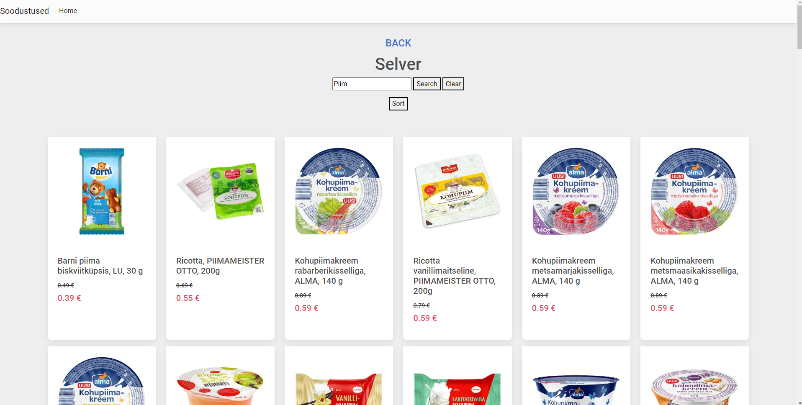

# Soodustused-scrapper

## Overview
A solution for tracking current discounts in various shops.

Represents an all-in-one webpage with the ability to check current discounted items.

### Functionality
Scrapes webpages of shops and writes its contents to H2 database file with create-drop mode.  
Writing mode to database can be changed in application.properties

### Features
If MainLauncher is run with the -debug argument a GUI will be opened to create or delete shop entries.  
IMPORTANT: IT IS NOT WEB-BASED GUI

### Requirements
- Google Chrome browser binary
- To run with the -debug machine should support java swing GUI

### Instructions
1. Download the repository.
2. Run the MainLauncher class.
3. Upon initialization, the application will open a specific tab in a web browser.

## Screenshots

### Main page

### A shop example
